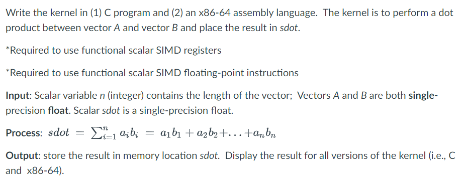
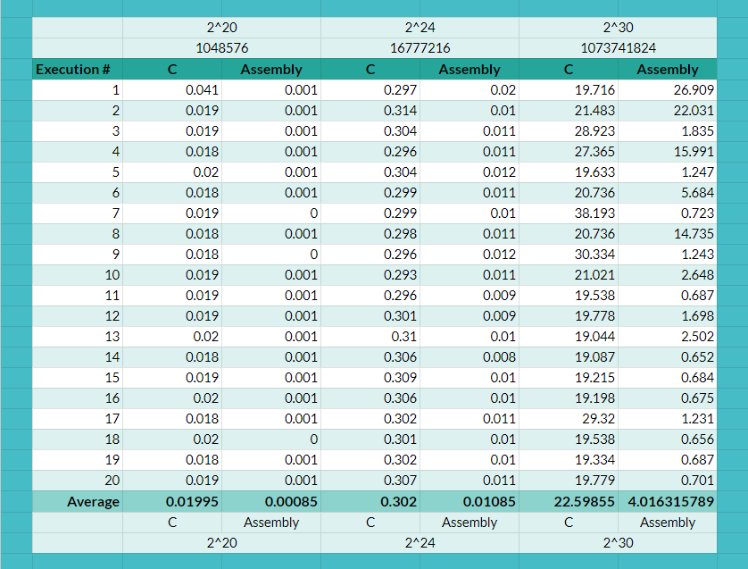
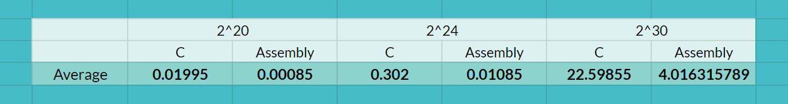
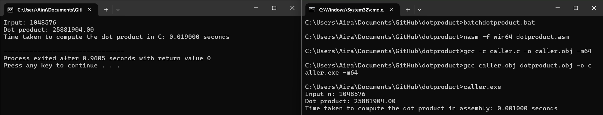
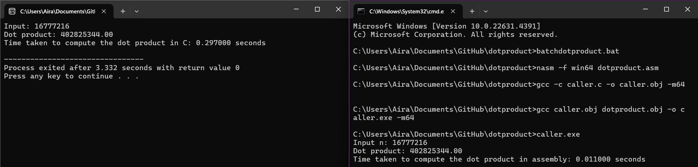
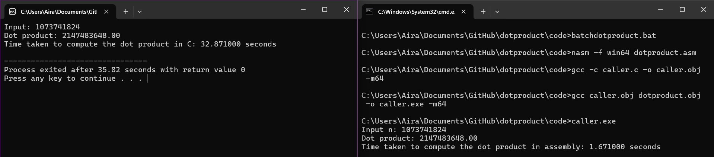
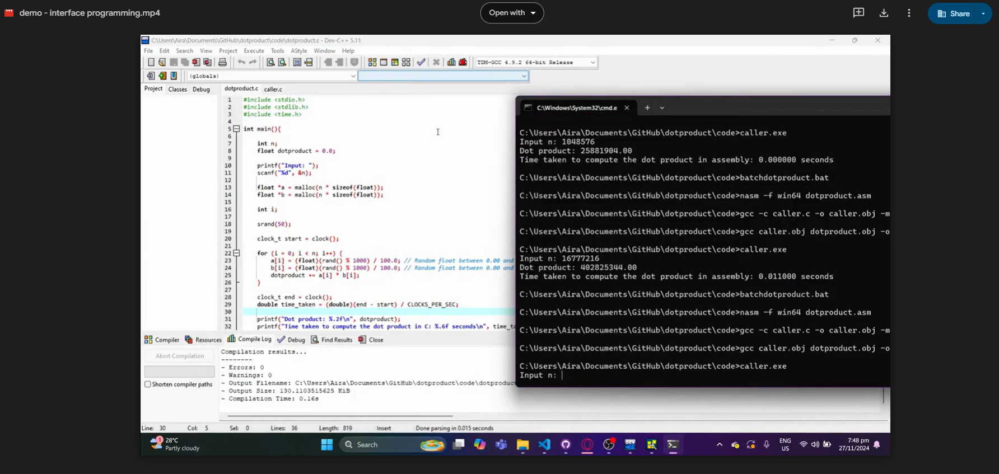

# Dot Product

MP Specifications:


## Files

```
/code
    caller.c
    dotproduct.c
    dotproduct.asm
    batchdotproduct.bat
/images
    specs.png
    exec_times.png
    avg_exec_times.png
/video
    demo.mp4
README.md
```

1.) dotproduct.asm
- x86-64 assembly program that calculates the dot product of 2 vectors, a & b, of size n

2.) dotproduct.c
- C program that creates two vectors of size n, initializes them with random values, computes their dot product, and measures the execution time of the computation

3.) caller.c
- C program that creates two vectors of size n, initializes them with random values, calls the dotproduct function from dotproduct.asm to compute their dot product, and measures the execution time of the function

## Performance

The average execution times of dotproduct.asm and dotproduct.c for n sizes 2<sup>20</sup>, 2^<sup>24</sup>, 2^<sup>30</sup> were tallied (in seconds) by running each program 20 times. 

The results for each execution are as follows:


The results for the average execution times are as follows:


The results show that the assembly program runs significantly faster than the C program consistently throughout the different vector sizes. This is because the assembly program is directly converted into machine code with an assembler [[1]](https://www.geeksforgeeks.org/introduction-of-assembler/), whereas the C program would have to be compiled first (with a compiler) into assembly-level instructions, before being assembled into machine code [[2]](https://www.geeksforgeeks.org/compiling-a-c-program-behind-the-scenes/). This additional step would contribute to slower execution, especially in larger vectors.

We can see through the results that as the vector size <b>increase</b>, the gap between execution times also <b>increases</b>.

## Program Output

For validation, a correctness check was performed by ensuring that both the C and assembly programs had the same output for the dot product. 


C program (left)&nbsp;&nbsp;&nbsp;&nbsp;&nbsp;&nbsp;Assembly program (right)

### 2<sup>20</sup> vector size 


### 2<sup>24</sup> vector size


### 2<sup>30</sup> vector size


## Demo Video

[Google Drive Link to Video Demo](https://drive.google.com/file/d/1-Qpfu5NtMSqJpeJ2IdzjMqb4H2cGAiA1/view?usp=drive_link)




